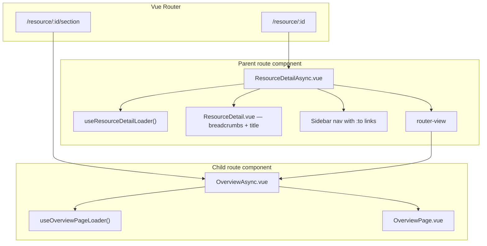

# Nested routes with AsyncPage

Some views are really a **layout** with several sub-views: a detail page with a sidebar, a settings area with tabs, a wizard step that shares chrome, and so on. Instead of switching tabs in local state, use **Vue Router nested routes** so each sub-view is its own page with its own loader and async wrapper.

This pattern keeps shared chrome (breadcrumbs, title, sidebar) in the parent while each child owns only the data it needs. Parent and child loaders run in parallel, child code is code-split per route, and TanStack Query deduplicates any shared requests.

## When to use it

Use nested routes when:

- Several sub-views share the same chrome (header, breadcrumbs, sidebar).
- Sub-views have **different data requirements** and you want those loaders separated.
- Sub-views should be addressable by URL (bookmarkable, back/forward, deep links).

Keep a single page with local tab state when sub-views are trivial, share identical data, or do not need their own URLs.

## Architecture



On navigation to `/resource/:id/overview`:

1. Vue Router mounts the **parent** route component (`ResourceDetailAsync.vue`).
2. The parent starts its loader and async-imports its chrome page (`ResourceDetail.vue`).
3. The parent's `<router-view>` mounts the **child** route component (`OverviewAsync.vue`) immediately — no waiting for the parent loader to finish first.
4. The child starts its own loader and async-imports its page component.
5. Parent chrome, child content, parent data, and child data all load **in parallel**. TanStack Query shares cache entries when both loaders use the same query keys.

There is no waterfall for code or data as long as each level uses the standard `*Async.vue` + `AsyncPage` pattern.

## Directory layout

Extend the usual page directory with one folder per child route:

```
resource-detail/
├── ResourceDetail.vue              # Shared chrome only (breadcrumbs, title)
├── ResourceDetail.loader.ts        # Data needed by chrome
├── ResourceDetail.strings.ts
├── ResourceDetailAsync.vue         # Layout: AsyncPage + sidebar + router-view
├── ResourceDetail.test.ts
│
├── overview/
│   ├── OverviewPage.vue
│   ├── OverviewPage.loader.ts
│   ├── OverviewAsync.vue
│   ├── OverviewPanel.vue           # Section-specific sub-components
│   └── …
├── settings/
│   ├── SettingsPage.vue
│   ├── SettingsPage.loader.ts
│   ├── SettingsAsync.vue
│   └── …
└── activity/
    ├── ActivityPage.vue
    ├── ActivityPage.loader.ts
    ├── ActivityAsync.vue
    └── …
```

Each child folder contains that section's page, loader, async wrapper, and sub-components. Keep section-specific components in the child folder rather than at the parent level.

## Parent layout component

The parent `*Async.vue` is the route component registered in `router.ts`. It renders shared chrome through `AsyncPage`, then a sibling `<router-view>` for the active child.

```vue
<template>
  <v-container>
    <AsyncPage
      :loader="useResourceDetailLoader"
      :page-component="ResourceDetail"
    />

    <div class="d-flex ga-4">
      <v-card class="resource-detail-sidebar flex-shrink-0" variant="outlined">
        <v-list nav density="compact">
          <v-list-item
            v-for="item in sidebarItems"
            :key="item.value"
            :to="item.to"
          >
            {{ item.label }}
          </v-list-item>
        </v-list>
      </v-card>

      <div class="flex-grow-1 min-width-0">
        <router-view />
      </div>
    </div>
  </v-container>
</template>

<script setup lang="ts">
import { computed, defineAsyncComponent } from "vue";
import { useRoute } from "vue-router";
import { useResourceDetailLoader } from "./ResourceDetail.loader.ts";
import { AsyncPage } from "@saflib/vue/components";

const ResourceDetail = defineAsyncComponent(
  () => import("./ResourceDetail.vue"),
);
</script>
```

Important details:

- **`AsyncPage` and `<router-view>` are siblings.** The child route mounts as soon as the parent component mounts; it does not wait for the parent's loader to resolve.
- **Navigation uses `:to` on list items** (or `router-link`) so Vue Router handles active state and history.
- **The parent loader stays minimal** — only queries the chrome needs (entity name, breadcrumb labels, display metadata, etc.).

The chrome page itself (`ResourceDetail.vue`) should be thin: breadcrumbs, title, and any layout logic that applies to every child. It should not render child content.

## Child route components

Each child route is a normal page: `OverviewAsync.vue` wraps `OverviewPage.vue` with `AsyncPage` and a dedicated loader.

```vue
<template>
  <AsyncPage
    :loader="useOverviewPageLoader"
    :page-component="OverviewPage"
  />
</template>

<script setup lang="ts">
import { defineAsyncComponent } from "vue";
import { useOverviewPageLoader } from "./OverviewPage.loader.ts";
import { overview_page as strings } from "./OverviewPage.strings.ts";
import { AsyncPage } from "@saflib/vue/components";
import { useAsyncPageDocumentTitle } from "@saflib/vue";

useAsyncPageDocumentTitle(strings.documentTitle);

const OverviewPage = defineAsyncComponent(
  () => import("./OverviewPage.vue"),
);
</script>
```

The child page component calls the same loader and renders the happy path. It composes sub-components from its own folder.

## Loaders

### Split data by responsibility

| Loader | Owns |
|---|---|
| Parent (`useResourceDetailLoader`) | Shared chrome: entity record, display title, breadcrumb context |
| Child (`useOverviewPageLoader`) | Section-specific queries: related records, section metadata, etc. |

Both loaders may call the same TanStack query (for example `getResourceQuery(resourceId)`). That is fine — TanStack deduplicates by query key, so only one network request runs and both components read the same cached result.

### Return only query objects from loaders used by AsyncPage

`AsyncPage` treats every value returned from a loader as a TanStack query and reads `query.isLoading.value`. Loaders consumed by `AsyncPage` must return **only** query-like objects (`useQuery` results or thin wrappers with `isLoading`, `isError`, and `error`).

Do **not** return bare `computed()` refs or other values from a loader passed to `AsyncPage`. Derive those in the page component from the query results instead.

```typescript
// Good — loader returns queries only
export function useOverviewPageLoader() {
  const resourceQuery = useQuery({ ...getResourceQuery(resourceId), ... });
  const relatedQuery = useQuery({ ...listRelatedResourcesQuery(resourceId), ... });
  return { resourceQuery, relatedQuery };
}

// In OverviewPage.vue — derive display values from query data
const resource = computed(() => loader.resourceQuery.data.value?.resource);
const summary = computed(() => resource.value?.summary ?? null);
```

See [Loader: Data Fetching](./02-components.md#loader-data-fetching) for the general loader rules (bounded query count, parallel fetching, no data-dependent query loops).

## Router configuration

Register the parent as the route component and list children underneath. Redirect the bare parent path to a default child with an **absolute** redirect function — a relative redirect like `{ path: "", redirect: "overview" }` can resolve incorrectly when other routes share path segments under the same `:id` prefix.

```typescript
{
  path: appLinks.resourceDetail.path, // e.g. "/resource/:id"
  component: ResourceDetailAsync,
  children: [
    {
      path: "",
      redirect: (to) => `${to.path}/overview`,
    },
    { path: "overview", component: OverviewAsync },
    { path: "settings", component: SettingsAsync },
    { path: "activity", component: ActivityAsync },
  ],
},
```

Child paths are relative to the parent, so `overview` matches `/resource/:id/overview`.

The parent link in your links package stays the base path (`/resource/:id`). The redirect sends users to the default child. You do not need separate link entries for each child unless you link to them directly from elsewhere in the app.

## Testing

Nested routes require mounting through a root `<router-view>`, not by mounting the parent async component directly. Mounting the parent alone leaves `<router-view>` at the wrong depth and child routes will not render.

```typescript
import { defineComponent } from "vue";
import { RouterView } from "vue-router";
import { mountWithPlugins } from "@saflib/vue/testing";
import { createAppRouter } from "../../../router.ts";

const RouterViewWrapper = defineComponent({
  components: { RouterView },
  template: "<RouterView />",
});

it("renders the default child", async () => {
  const router = createAppRouter();
  await router.push("/resource/res_test/overview");
  await router.isReady();

  const wrapper = mountWithPlugins(
    RouterViewWrapper,
    {},
    { router, i18nMessages: app_strings },
  );

  await vi.waitFor(() =>
    expect(wrapper.text()).toContain("Expected content from child page"),
  );
});
```

To exercise sidebar navigation or cross-section behavior, call `router.push("/resource/res_test/settings")` and `await flushPromises()` rather than clicking list items — route navigation is what you are testing.

When updating tests that previously expected navigation to the bare parent path, account for the default-child redirect (for example expect `/resource/:id/overview` instead of `/resource/:id`).

See [Testing](./04-testing.md) for general render-test guidance.

## Checklist

When adding a nested route layout:

1. Slim the parent loader to chrome-only queries.
2. Create a child folder per section with `*Page.vue`, `*Page.loader.ts`, and `*Async.vue`.
3. Register nested routes in `router.ts` with an absolute default-child redirect.
4. Wire sidebar (or tab) navigation with `:to` paths under the parent base path.
5. Keep section-specific sub-components in the child folder; child pages compose them.
6. Add component tests only for route-driven **behavior** (mount through `<RouterView />`, push to explicit child paths, assert section content) — not render-only smokes.
